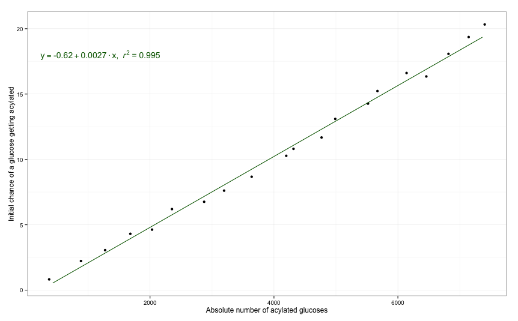
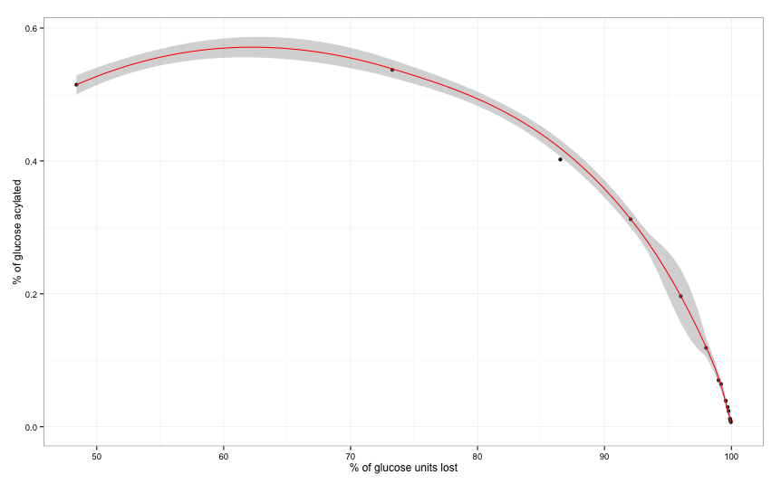
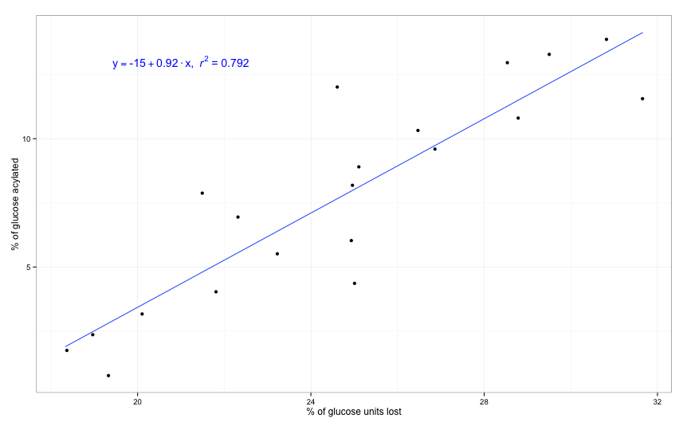

##Glyco2D does work!

- When we increase the initial percentage of random acylation, the total number of modified glucoses increased. We showed a great linear correlation between both. 

##If the acylation always restricts growth/branching

As we're using putative acyltransferases in E. coli, we don't know the carbon in the glucose molecule that gest acylated. If it binds to C4, the acylation will restrict further growth of the glycogen molecule. 

As we can see, by having a chance of acylation of 1% at C4, the glucose lost is around 50%. By 'glucose lost' we mean all the glucose molecules that could haven been added to the umodified molecule. 

Therefore, if the acyl group binds to C4, we won't have a viable glycogen molecule and the modification will not have the effect we expect. 

##If the acylation might restrict growth/branching

Another hypothesis is that the acyltransferase can add the group to any carbon on the glucose molecule. We assume a random chance of a group being added on the 5 carbons available in the molecule. If it is added to C4, it will restrict growth. If it is added to C6, it might restrict branching if it binds to the glucose molecule in the 5th or 10th position in the chain (branching points). The normal growth will not be altered if it binds C2, C3 or C5. 

We ran the simulation 300 times for each % of acylation and calculated the average for all the possible randomly generated molecules. We observed a good correlation between the final % of acylated glucoses and the % of glucose molecules that are lost in comparison to the unmodified molecule. We need to define the optimal value so that we get the minimum glucose lost with the maximum level of acylation.  