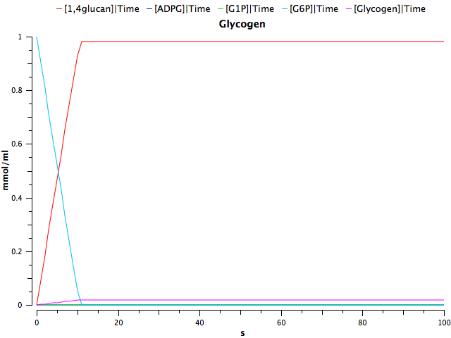

#####Assumptions:

We generated a deterministic model taking into consideration the following assumptions:

- All enzyme concentrations are constant and similar. We fixed the enzyme concentrations to 1x10-5 mmol/mL

- Glucose is available in excess.

- Reactions follow simple reversible or irreversible Michaelis-Menten kinetics.

- There is no additional flux of substrates after the beginning of the simulation. 

- The intracellular metabolite concentrations (ATP, AMP, ADP and PPi) are constant. They are all set to 1x10-5 mmol/mL.

- Only competitive inhibition by the product occurs. For simplicity, other external inhibitors are not considered in the model.

###Enzyme kinetic rates

Enzyme| Km (mmol/mL)| Reference
-----|-----|----:
Phosphoglucomutase(G1P)| 2.9x10-4| [1](http://www.sciencedirect.com/science/article/pii/S1096717699901453)
Phosphoglucomutase(G6P)|5.6x10-6| [1](http://www.sciencedirect.com/science/article/pii/S1096717699901453)
GlgC(ADPG)| 4x10-5|[2](http://www.ncbi.nlm.nih.gov/pubmed/21741429)
GlgC(ATP) |3.2x10-4|[2](http://www.ncbi.nlm.nih.gov/pubmed/21741429)
GlgA|3.5x10-5|[3](http://www.ncbi.nlm.nih.gov/pubmed/2288)
GlgB(Glucan1-4)| 1.42x10-5| [4](http://www.ncbi.nlm.nih.gov/pubmed/11368019)
GlgX (Glycogen)| 1x10-6| -not found-

2 substrate irreversible reaction: Vmax*substrateA*substrateB/(KmB*substrateA + kmA*substrateB + substrateA*substrateB)

All the reactions of the pathway are highly efficient, as all the initial glucose-6-P converted to glucose-1-P and ADP-glucose is used in the production of glycogen. Part of the glucose-1-P is recovered due to the GlgX debranching activity.

We run our model for 2500 seconds and collect the data in intevals of 0.05 seconds starting with a concentration of 10 mmol/mL of Glucose-6-P (G6P). After the time course, the majority of the starting glucose has been used to produce glycogen and only a small part of the glucose stays unbranched.

