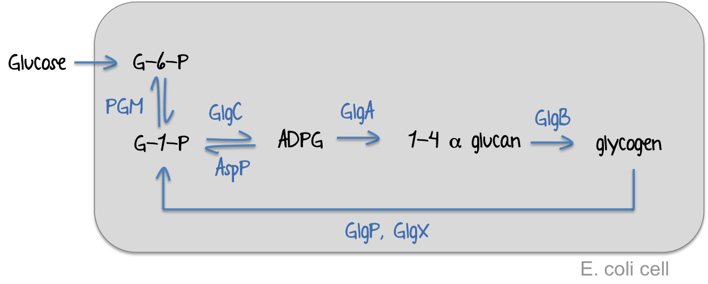
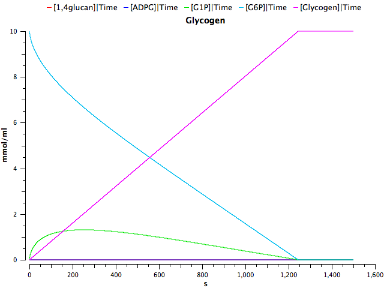

Kinetic modelling
===
As a proof of concept, we used glycogen as a model molecule to test the effect of branching and debranching enzymes in E. coli. 

To analyse the efficiency of the branching (GlgB) and debranching (GlgX) enzymes in glycogen production, we generated a set of differential equations to explain glycogen biosynthesis.  We used COPASI (1) (http://copasi.org/) to simulate the biochemical reactions involved in the production of glycogen in bacterial cell. We used the the glycogen biosynthesis pathway defined by Wilson WA et al (2) to build our model. The kinetics parameters were found  at http://www.metacyc.org/ 

\begin{center}	
Glycogen Pathway (2)
\end{center}
 

We generated a deterministic model taking into consideration the following assumptions:

1. All enzyme concentrations are constant and similar. We fixed the enzyme concentrations to 1x10-5 mmol/mL
2. Glucose is available and limiting (initial concentration 10 mmol/ml)
3. Reactions follow simple reversible or irreversible Michaelis-Menten kinetics.
4. There is no additional flux of substrates after the beginning of the simulation.  
5. The intracellular metabolite concentrations (ATP, AMP, ADP and PPi) are constant. They are all set to 1x10-5 mmol/mL.
6. Only competitive inhibition by the product occurs. For simplicity, other external inhibitors are not considered in the model.
7. GlgX and GlgP were considered together in the same as the action of both enzymes together is required to get debranching of glycogen.
8. The reaction rates for all the reactions is V = 0.01

GlgB catalyzes 2 consecutive reactions. First, it cleaves an alpha 1,4 glycosidic linkage in a linear glucan to form a non-reducing-end oligosaccharide chain that is transferred to a C-6 
hydroxyl group of the same or another glucan. GlgP removes up to 5 glucose units from the glycogen outer chain and GlgX only cuts when there are 3-4 glucose residues left at the branching point. 
###Enzyme kinetic rates

Enzyme| Km (mmol/mL)| Reference
-----|-----|----:
Pgm(G1P)| 2.9x10-4| [(3)](http://www.sciencedirect.com/science/article/pii/S1096717699901453)
Pgm(G6P)|5.6x10-6| [(3)](http://www.sciencedirect.com/science/article/pii/S1096717699901453)
GlgC(ADPG)| 4x10-5|[(4)](http://www.ncbi.nlm.nih.gov/pubmed/21741429)
GlgC(ATP) |3.2x10-4|[(4)](http://www.ncbi.nlm.nih.gov/pubmed/21741429)
AspP (ADPG) | 0.000167| (7)
GlgA|3.5x10-5|[(5)](http://www.ncbi.nlm.nih.gov/pubmed/2288)
GlgB(Glucan1-4)| 1.42x10-5| [(6)](http://www.ncbi.nlm.nih.gov/pubmed/11368019)
GlgX (Glycogen)| 1x10-6| -not found-
GlgP (Glycogen)| 1x10-6| -not found-

<table style="width:100%">
  <tr>
    <th>Enzyme</th>
    <th>Km (mmol/mL)</th> 
    <th>Reference</th>
  </tr>
  <tr>
    <td>Pgm(G1P)</td>
    <td>2.9x10-4</td> 
    <td>(3)</td>
  </tr>
    <tr>
    <td>Pgm(G6P)</td>
    <td>5.6x10-6</td> 
    <td>(3)</td>
  </tr>
    <tr>
    <td>GlgC(ADPG)</td>
    <td>4x10-5</td> 
    <td>(4)</td>
  </tr>
    <tr>
    <td>GlgC(ADPG)</td>
    <td>1.67x10-4</td> 
    <td>(4)</td>
  </tr>
      <tr>
    <td>AspP (ADPG)</td>
    <td>3.2x10-4</td> 
    <td>(7)</td>
  </tr>
      <tr>
    <td>GlgA</td>
    <td>3.5x10-5</td> 
    <td>(5)</td>
  </tr>
        <tr>
    <td>GlgB(Glucan1-4)</td>
    <td>1.42x10-5</td> 
    <td>(6)</td>
  </tr>
        <tr>
    <td>GlgX (Glycogen)</td>
    <td>1x10-6</td> 
    <td>Not found</td>
  </tr>
<tr>
    <td>GlgP (Glycogen)</td>
    <td>1x10-6</td> 
    <td>Not found</td>
  </tr>
</table>

\newpage

All the reactions of the pathway are highly efficient, as all the initial glucose-6-P converted to glucose-1-P and ADP-glucose, that is the glycosil donor to syntehsase glycogen. Part of the glucose-1-P is recovered due to the GlgX debranching activity.
We set all the reaction rates to 0.01 mmol/(mL*s) expect for GlgX-GlgP that was set to 0.002 mmol/(mL*s) to avoid the immediate degradation of all the glycogen being produced. Those were considered our basal conditions. After 50 minutes, all the initial glucose is being converted into glycogen 

We run our model for 50 minutes and collect the data in intevals of 0.05 seconds starting with a concentration of 10 mmol/mL of Glucose-6-P (G6P). After the time course, the majority of the starting glucose has been used to produce glycogen and only a small part of the glucose stays unbranched.

When the enzyme concentration is small, Vmax is much smaller. The reaction rate still increases with increasing substrate concentration, but levels off at a much lower rate. By increasing the enzyme concentration, the maximum reaction rate greatly increases.

Differential equations
===
<html>
<head>
<title>MathJax TeX Test Page</title>

</head>
<body>

$$
\begin{array}{ccl}
\frac {\mathrm{d}\left( {{\mathrm{[G6P]}} \,  } \right) }  {\mathrm{d}{t} }  \; &=& \;  { \, - \,  \, \left(\frac {\frac {{\mathrm{Vf}}_{\mathrm{(Pgm)}} \, \cdot \, {\mathrm{[G6P]}} } {{\mathrm{Kms}}_{\mathrm{(Pgm)}} } \, - \, \frac {{\mathrm{Vr}}_{\mathrm{(Pgm)}} \, \cdot \, {\mathrm{[G1P]}} } {{\mathrm{Kmp}}_{\mathrm{(Pgm)}} } }  { {{1} \, + \, \frac{\mathrm{[G6P]}}{{\mathrm{Kms}}_{\mathrm{(Pgm)}} } }  \, + \, \frac{\mathrm{[G1P]}}{{\mathrm{Kmp}}_{\mathrm{(Pgm)}} } } \right) } \\ 
 && \\ 
\frac {\mathrm{d}\left( {{\mathrm{[G1P]}} \,  } \right) }  {\mathrm{d}{t} }  \; &=& \;  { \, + \,  \,  \left(\frac {\frac {{\mathrm{Vf}}_{\mathrm{(Pgm)}} \, \cdot \, {\mathrm{[G6P]}} } {{\mathrm{Kms}}_{\mathrm{(Pgm)}} } \, - \, \frac {{\mathrm{Vr}}_{\mathrm{(Pgm)}} \, \cdot \, {\mathrm{[G1P]}} } {{\mathrm{Kmp}}_{\mathrm{(Pgm)}} } }  { {{1} \, + \, \frac{\mathrm{[G6P]}}{{\mathrm{Kms}}_{\mathrm{(Pgm)}} } }  \, + \, \frac{\mathrm{[G1P]}}{{\mathrm{Kmp}}_{\mathrm{(Pgm)}} } } \right) } \\ 
 && \\ 
 \; && \;  { \, - \,  \, \left(\frac { {{\mathrm{Vmax}}_{\mathrm{(GlgC)}} \, \cdot \, {\mathrm{[G1P]}} }  \, \cdot \, {\mathrm{[ATP]}} }  { { { {{\mathrm{KmB}}_{\mathrm{(GlgC)}} \, \cdot \, {\mathrm{KmA}}_{\mathrm{(GlgC)}} }  \, + \,  {{\mathrm{KmB}}_{\mathrm{(GlgC)}} \, \cdot \, {\mathrm{[G1P]}} }  }  \, + \,  {{\mathrm{KmA}}_{\mathrm{(GlgC)}} \, \cdot \, {\mathrm{[ATP]}} }  }  \, + \,  {{\mathrm{[G1P]}} \, \cdot \, {\mathrm{[ATP]}} }  } \right) } \\ 
 && \\ 
 \; && \;  { \, + \,  \,  \left(\frac {{V}_{\mathrm{("GlgX-GlgP")}} \,  {\mathrm{[Glycogen]}} }  {{\mathrm{Km}}_{\mathrm{("GlgX-GlgP")}} \, + \, {\mathrm{[Glycogen]}} } \right) } \\ 
 && \\ 
 \; && \;  { \, + \,  \,  \left(\frac {{V}_{\mathrm{(AspP)}} \, \cdot \, {\mathrm{[ADPG]}} }  {{\mathrm{Km}}_{\mathrm{(AspP)}} \, + \, {\mathrm{[ADPG]}} } \right) } \\ 
 && \\ 
\frac {\mathrm{d}\left( {{\mathrm{[ADPG]}} \,   } \right) }  {\mathrm{d}{t} }  \; &=& \;  { \, - \,  \,  \left(\frac {{V}_{\mathrm{(GlgA)}} \, \cdot \, {\mathrm{[ADPG]}} }  {{\mathrm{Km}}_{\mathrm{(GlgA)}} \, + \, {\mathrm{[ADPG]}} } \right) } \\ 
 && \\ 
 \; && \;  { \, + \,  \,  \left(\frac { {{\mathrm{Vmax}}_{\mathrm{(GlgC)}} \, \cdot \, {\mathrm{[G1P]}} }  \, \cdot \, {\mathrm{[ATP]}} }  { { { {{\mathrm{KmB}}_{\mathrm{(GlgC)}} \, \cdot \, {\mathrm{KmA}}_{\mathrm{(GlgC)}} }  \, + \,  {{\mathrm{KmB}}_{\mathrm{(GlgC)}} \, \cdot \, {\mathrm{[G1P]}} }  }  \, + \,  {{\mathrm{KmA}}_{\mathrm{(GlgC)}} \, \cdot \, {\mathrm{[ATP]}} }  }  \, + \,  {{\mathrm{[G1P]}} \, \cdot \, {\mathrm{[ATP]}} }  } \right) } \\ 
 && \\ 
 \; && \;  { \, - \,  \,  \left(\frac {{V}_{\mathrm{(AspP)}} \, \cdot \, {\mathrm{[ADPG]}} }  {{\mathrm{Km}}_{\mathrm{(AspP)}} \, + \, {\mathrm{[ADPG]}} } \right) } \\ 
 && \\ 
\frac {\mathrm{d}\left( {{\mathrm{[1,4glucan]}} \, \cdot \, {V}_{\mathrm{cytoplasm}} } \right) }  {\mathrm{d}{t} }  \; &=& \;  { \, + \, \left(\frac {{V}_{\mathrm{(GlgA)}} \, \cdot \, {\mathrm{[ADPG]}} }  {{\mathrm{Km}}_{\mathrm{(GlgA)}} \, + \, {\mathrm{[ADPG]}} } \right) } \\ 
 && \\ 
 \; && \;  { \, - \,  \left(\frac {{V}_{\mathrm{(GlgB)}} \, \cdot \, {\mathrm{[1,4glucan]}} }  {{\mathrm{Km}}_{\mathrm{(GlgB)}} \, + \, {\mathrm{[1,4glucan]}} } \right) } \\ 
 && \\ 
\frac {\mathrm{d}\left( {{\mathrm{[Glycogen]}} \,  } \right) }  {\mathrm{d}{t} }  \; &=& \;  { \, + \,  \, \left(\frac {{V}_{\mathrm{(GlgB)}} \, \cdot \, {\mathrm{[1,4glucan]}} }  {{\mathrm{Km}}_{\mathrm{(GlgB)}} \, + \, {\mathrm{[1,4glucan]}} } \right) } \\ 
 && \\ 
 \; && \;  { \, - \,  \, \left(\frac {{V}_{\mathrm{("GlgX-GlgP")}} \,\cdot \, {\mathrm{[Glycogen]}} }  {{\mathrm{Km}}_{\mathrm{("GlgX-GlgP")}} \, + \, {\mathrm{[Glycogen]}} } \right) } \\ 
 && \\ 
\end{array}
$$
</body>
</html>

##References

1. Hoops S, Sahle S, Gauges R, Lee C, Pahle J, Simus N, Singhal M, Xu L, Mendes P, Kummer U: COPASI–a cOmplex pAthway sImulator. Bioinformatics 2006, 22:3067–74.

2. Wilson WA, Roach PJ, Montero M, Baroja-Fernández E, Muñoz FJ, Eydallin G, Viale AM, Pozueta-Romero J: Regulation of glycogen metabolism in yeast and bacteria. FEMS Microbiol Rev 2010, 34:952–85.

3. Brautaset T, Petersen SB, Valla S: In vitro determined kinetic properties of mutant phosphoglucomutases and their effects on sugar catabolism in escherichia coli. Metab Eng 2000, 2:104–14.

4. Figueroa CM, Esper MC, Bertolo A, Demonte AM, Aleanzi M, Iglesias AA, Ballicora MA: Understanding the allosteric trigger for the fructose-1,6-bisphosphate regulation of the aDP-glucose pyrophosphorylase from escherichia coli. Biochimie 2011, 93:1816–23.

5. Fox J, Kawaguchi K, Greenberg E, Preiss J: Biosynthesis of bacterial glycogen. purification and properties of the escherichia coli b aDPglucose:1,4-alpha-d-glucan 4-alpha-glucosyltransferase. Biochemistry 1976, 15:849–57.

6. Mikkelsen R, Binderup K, Preiss J: Tyrosine residue 300 is important for activity and stability of branching enzyme from escherichia coli. Arch Biochem Biophys 2001, 385:372–7.

7. Moreno-Bruna B, Baroja-Fernández E, Muñoz FJ, Bastarrica-Berasategui A, Zandueta-Criado A, Rodriguez-López M, Lasa I, Akazawa T, Pozueta-Romero J: Adenosine diphosphate sugar pyrophosphatase prevents glycogen biosynthesis in escherichia coli. Proc Natl Acad Sci U S A 2001, 98:8128–32.

