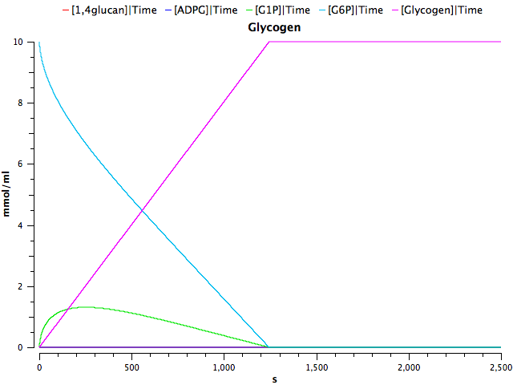

#####Assumptions:

We generated a deterministic model taking into consideration the following assumptions.

- All enzyme concentrations are constant and similar. We fixed the enzyme concentrations to 1x10-5 mmol/mL

- Glucose is available in excess.

- Reactions follow simple reversible or irreversible Michaelis-Menten kinetics.

- There is no additional flux of substrates after the beginning of the simulation. 

- The intracellular metabolite concentrations (ATP, AMP, ADP and PPi) are constant. They are all set to 1x10-5 mmol/mL.

- Only competitive inhibition by the product occurs. For simplicity, other external inhibitors are not considered in the model.

###Enzyme kinetic rates

Enzyme| Km (mmol/mL)| Reference
-----|-----|----:
Phosphoglucomutase(G1P)| 0.00029| [1](http://www.sciencedirect.com/science/article/pii/S1096717699901453)
Phosphoglucomutase(G6P)|5.6e-06| [1](http://www.sciencedirect.com/science/article/pii/S1096717699901453)
GlgC(ADPG)| 4e-05|
GlgC(ATP) |0.00032|
GlgA|3.5e-05
GlgB(Glucan1-4)| 1e-05|
GlgB(Glycogen)| 2e-07|
GlgX (Glycogen)| 1e-06|

2 substrate irreversible reaction: Vmax*substrateA*substrateB/(KmB*substrateA + kmA*substrateB + substrateA*substrateB)

The first reactions of the pathway are highly efficient, as all the initial glucose-6-P converted to glucose-1-P and ADP-glucose is used in the production of glucan. 

After running our model for 10000 seconds and collecting the data in intevals of  10 seconds, we saw that glycogen branching is not a favored process. Under basal conditions, the reversability of GlgB and the action of GlgX favored the linear structure of glycogen (glucan-1-4). If we start with a concentration of 5 mmol/mL of Glucose-6-P (G6P), after the time course the majority of this glucose has been used to produce linear glucan and only a small part of the glucose is generating branched  glycogen:

Then, if we change GlgB Kms for the glucan from 1e-5 mmol/mL to 1e-6 mmol/mL, we can see how the glycogen production is increased:

